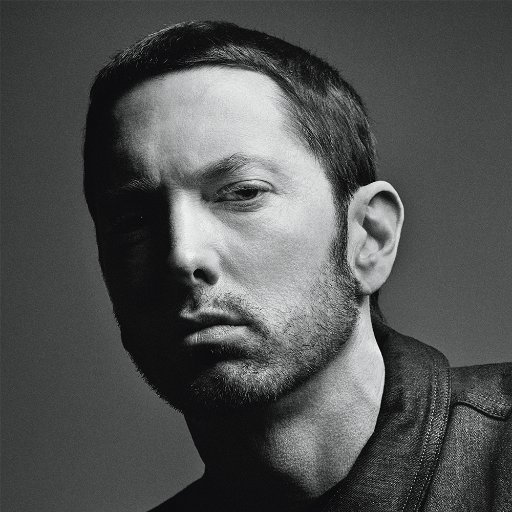
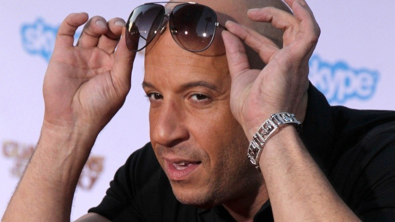

Wow! I just realized it's my third post didn't expect to come this far. Am I addicted to this somehow now?

Well! nerdism is a religion now.
Society has just turned bonkers after seeing some "You know who" movies.
Just like "savage", the word meant to ridicule somebody for there love and passion for something has been made into a glory stamp everyone wants.
These days everyone from the youngest to great grand parents are getting high on the nerd drug.
Something which people used to hide to prove themselves normal is now what everyone wants to be.

This switch in things has made me feel a lot more confused and conflicted.
There are times I feel like making people regret it for even going close to even saying the "N" and then then I am like maybe the OG did the right job. 

Most of my anger for the people thinking that they're nerds is mostly around there poor appreciation of what makes a true.
It's not just about watching some movies with superheroes and watching some TV shows.
This shallow understanding about anything is defeat to the soul of being a nerd.
Nerd is a person whose passion for something is so deep that it's almost an obsession.
Image of a nerd in modern time is highly deceiving because it's based on what hollywood wants you to believe.
These are some highly passionate people who might be hiding plain sight.
Let's take some examples:

# 1. Eminem

Legendary Slim Shady.
If you can't understand the references here "Kneel before General Zod this planet's Krypton, no Asgard, Asgard".
You don't understands this rapper's love for comic books.

# 2. Vin Diesel

The one only family man was a game developer before being an amazing movie star.
He's been heavily into gaming before inspiring him to take up his first job.

# 3. Mila Kunis

Super famous actress used to play a lot of World of Warcraft in her free time. 

So yeah everyone's not like how one sitcom potrays nerds.
In truth we're normal people who have their own love and passion for things.
I feel unhappy when people who don't understand any of it believe they're good enough to claim the title.

At the same time seeing people trying their best to understand this culture makes mee feel somewhat happy.
It tells people slowly accepting things we feel happy about cool rather than making it feel uncool.  

That's my general perspective around things about everyone feeling they're nerds
At the end I feel they're some words and title shouldn't be taken that lightly.
As said **"Little knowledge is a dangerous"**.

I was listening to "Rewrite" by "Asian Kung-Fu Generation".
Here's the link: https://music.youtube.com/watch?v=BXg4yk7se_0&feature=share