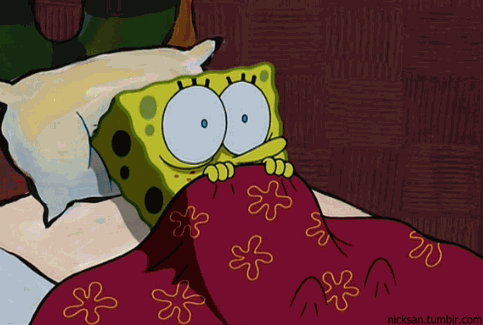
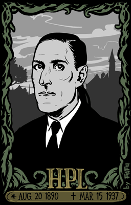
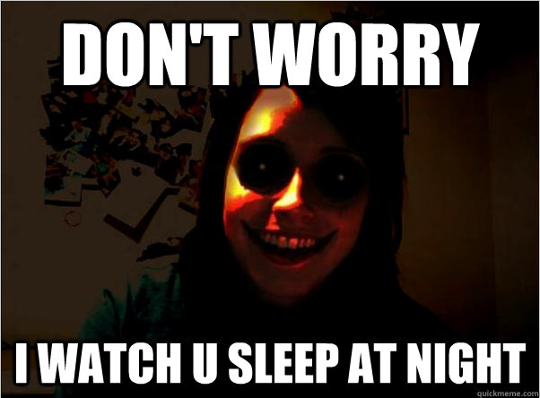

Welcome to my second post people! :metal:

I don't know where this came out from but suddenly I wanted to talk about horror content available to us in general.
I blame it on me watching the "Typewriter" and re-visiting "Another" on netflix.

Since I was a kid I have always been a big fan of horror movies.
They have also been a reason that I never slept alone at night till I was like 15 and I still keep some kind of light on while I sleep.

This me trying to sleep after a horror movie:

Before I get into my rant of how horror today is just a pile of jump scares, I would like to talk about how horror is rather important for us.
Fear is a human instinct from our ancestors to us.
It kicks our fight or flight instinct for survival.
The general fear of the unknown has always been a way for us to make smart choices for survival. We might say "we're not scared" but in truth during all our decision making does involve some amount of fear.
Horror or general dread of unknown helps us prepare for survival.
I feel that the fear of the unknown is in general most natural way of feeling fear.

Horror as a genre has always been meant to make the viewer the uncomfortable and disoriented.
My love for horror has always been stuck around the idea of understanding the unknown so as to be less scared.
In general, most horror stories try to build a strong background to support the storyline.
Exploring those mythos and back stories is the way to figure out what you're dealing.
At the same time, I weirdly enjoy and hate the creepy atmosphere that's built.
These two prime things are responsible for tingling your natural instinct and kick in your worst fears.

But some movies try to break these points like the netflix movie **"The Open House"** or **"You're Next"** where the assailant is completely unknown and no information is not provided about them.
Similarly, something like **"It follows"** generally doesn't creates a major creepy atmosphere.
Yet these movies do a great job of presenting great horrors in different format.

My favourite genre of horror is **atmospheric** or **lovecraftian**.
I think it started it with the above mentioned anime called "Another" which lead me to "Uzumaki" from by Junji Ito.
One by one I was a big fan of Junji Ito and then H.P. Lovecraft.
I am weirdly committed to understanding the Lovecraftian Universe.

This guy's a true legend:

My hatred for horror movie is much about of how majority of horror movies just target jump scares to get you scared.
I have never enjoyed it as a person because in real life a jump scare in most scenarios will lead to a punch in the face.

At the same time I have enjoyed genre mix-ups like **"Shaun of the dead"**, **"The Host"** and **"Let the right one in"**.
I love it how it can be disorienting as hell when comedy can be used to put you in a really calm place and change your thoughts.
"The Host" always is playing with your expectations where with a clumsy character your understanding of situations is broken to put you in a calm place to betray it the next moment.

I have really felt like going back to horror for sometime now but I have just been too much of a bitch to do it but may be in sometime.
Just need to find a person who doesn't give a shit and guard me while i sleep :fearful:.

Till then guys my friend has to say something:

 