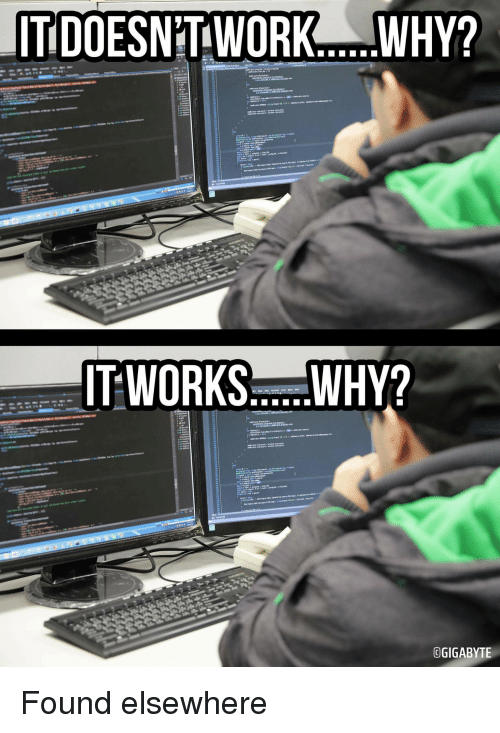
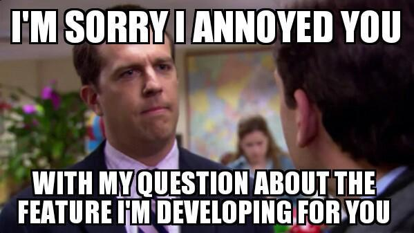

That sounds like a really bad title but welcome to a rather weird post.
I have always came back to this question after some point of time.
To give you a better idea I recently started working in software.
I have been here for 2 years now.
One year as an intern and one year as an full time employee.
This post is pretty much about the whole experience of it till today.
I feel it'll change with time so this might be the first of many such posts.

Before I jump into nuances here's an idea of what I work on.
I presently work as an Software Engineer on a platform know as 3D.
My platform does a lot of things which might be a blog in itself and a reason for me getting fired.
In a nutshell, it's all things related to 3D and what 3D can be used for.
As per a skill set or technical knowledge required for doing what I do will be anything or everything that can be used to finish the job :laughing:.
Only thing in general I need to consider while doing the above is to justify what I use to my super cool architect.
But for a base idea here's what I've used till now:
* Java - Webservices
* Javascript - UI, web components and desktop tools
* Python - Scripting and blender
* Bash - Scripting
* Groovy - Pipeline
* Lot of things here and there :laughing:

In order of things this is my third team.
When I started as an intern I used to work with Localization and Expert Support team.
After turning full time I worked primarily with a platform team known as "SDK".
Each team has been responsible for my growth as a professional I am today.

To be frank my experience has been a interesting one.
Starting as an intern I worked with teams which were non-technical.
So a lot of figuring out what had to be done was figured out by me and asking a lot of people around.
A lack of technical supervision felt empowering and little problematic though.
It felt empowering because you were the deciding factor for everything.
On the other side lack of supervision made me realise that I had missed out on a lot of things.
These things I could have improved the way I did things.

With my second team, there was a lot to learn but it all had to be done very quickly.
In general, we were taking care of a lot legacy stuff.
I had to learn being agile and improve my understanding of engineering practices.
At the same time to work in a lot of constraints. 
Also a lot more understanding of office politics.

Working for my present team has been an interesting experience.
It has been about becoming more about independent.
Getting involved in technical and planning discussions.
Understanding end to end cycle of things to provide better solutions.
Also not limiting your imagination :heart_eyes:.

In between of all these things I have done a lot of other stuff like:
* helping devops team with weird stuff
* working on side projects
* becoming part of some internal open source projects

In whole what doing software feels like it's less about writing code and understanding a lot of things around software.
These things include:
* Understanding requirements, domain knowledge and user perspective to say a few.
* Learning and implementing technologies and engineering practices at work or outside work.
* Growing the vision to understand the bigger perspective or the series of endgames yet to occur :wink:.
* Adapting to stuff at batshit speeds.
* Delivering things on time with due process.
* Also at the same time making sure people understand what you do.
* Sharing what you've done and understanding what other people do.
* Taking chances
* Accepting failures and imperfections
* Having tons of patience
* Most importantly having fun

Presently, I feel this has been my perspective of what doing software feels like.
A lot of these things might seem unnecessary but all these things will be responsible for how you do software.  
As I said earlier it might change with time.
So yeah you might see a completely different perspective in future.
At the end it boils down to 2 these 2 things:

This is something I want to try.
At the end of the blog I will add the song which I'm listening to while I started writing.
For today it was "Magnetic Moon" by "Tiffany Young".
Here's a link to it https://music.youtube.com/watch?v=FfKHy0inTPQ&feature=share.

  